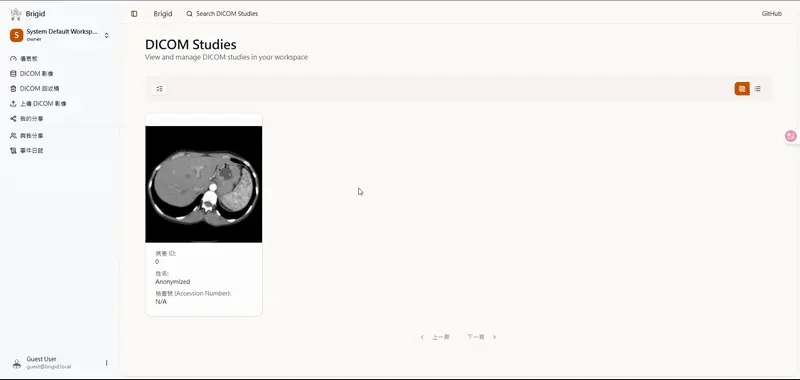

## 📄 DICOM 管理功能

Brigid 支援全面的 DICOM 影像管理，包含檢索、存取與刪除

## 📂 直覺的層級化管理

Brigid 將影像依據 DICOM 標準分為 `Study` → `Series` → `Instance` 三個層級

就像使用資料夾一樣簡單，您可以從病患的單次檢查一路深入到每一張影像細節

## 🖼️ 客製化的瀏覽佈局

你可以根據當下的需求，自由切換排版方式：
- 表格模式：列表呈現，數據一目了然
- 卡片模式：視覺預覽，快速鎖定影像