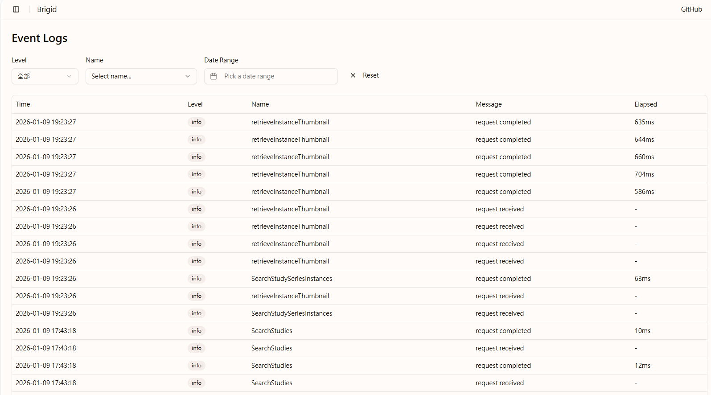

Brigid features a built-in event logging system that records various operations within the platform. Administrators can monitor system status, track user activities, and perform rapid troubleshooting when anomalies occur.

## Key Features

- **Log Viewing**: Real-time access to all event records generated by the system.
- **Multi-dimensional Filtering**:
  - **Level Filter**: Supports three levels—`Info`, `Warning`, and `Error`—to help quickly isolate critical issues.
  - **Name Filter**: Enables precise searches for specific DICOM operations and system behaviors.

## Supported Event Types (Event Names)

To facilitate management and precise troubleshooting, Brigid categorizes DICOM-related events into the following groups. You can filter records based on these specific event names:

| Category | Supported Event Names |
| :--- | :--- |
| **Storage** | `storeInstance` |
| **Search** | `searchStudies`, `searchSeries`, `searchInstances`, `searchStudySeries`, `searchStudySeriesInstances` |
| **Retrieve** | `retrieveStudy`, `retrieveSeries`, `retrieveInstance` |
| **Rendered Retrieval** | `retrieveRenderedSeries`, `retrieveRenderedInstance`, `retrieveRenderedFrames`, `retrieveFramePixelData` |
| **Thumbnail Retrieval** | `retrieveStudyThumbnail`, `retrieveSeriesThumbnail`, `retrieveInstanceThumbnail` |
| **Metadata Retrieval** | `retrieveStudyMetadata`, `retrieveSeriesMetadata`, `retrieveInstanceMetadata` |