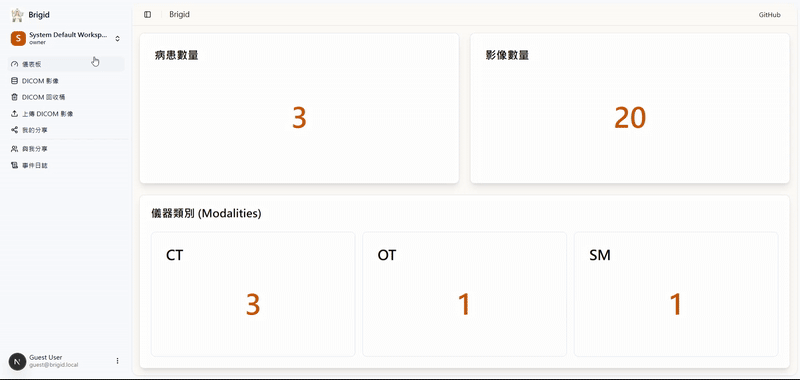

## Multi-Workspaces Features

Brigid supports multi-workspace architecture, allowing users to create and manage multiple workspaces.

- Workspace Management: Create, delete, and manage workspaces
- Workspace Collaboration: Collaborate with other users in the same workspace