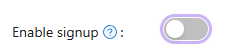
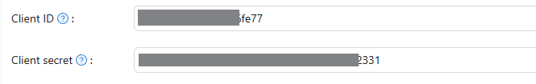

import { Steps, Step } from "fumadocs-ui/components/steps";

## Casdoor OAuth 配置流程

<Steps>
    <Step>
        ## 創建 Organization

        - 前往 `User Management` -> `Organizations` 頁面
        
        - 點擊 `Add` 按鈕
        - 填寫 `Name`, `Display Name` 等資訊
        - 點擊 `Save & Exit` 按鈕
    </Step>

    <Step>
        ## 創建 Application

        - 前往 `Identity` -> `Applications` 頁面
        
        - 點擊 `Add` 按鈕
        - 填寫 `Name`, `Display Name` 等資訊
        
        - 設定 `Redirect URLs`，例如：`http://localhost:3119/api/auth/callback/casdoor`
        
        - 關閉註冊
            - 為了保證應用程式的安全性，建議關閉 Casdoor 的註冊功能，由管理員手動新增使用者
            - 將 `Enable Signup` 設為 `false`
            
        - 點擊 `Save` 按鈕
    </Step>

    <Step>
        ## 獲取 Client ID 和 Client Secret

        - 進入剛剛建立的 Application 頁面
        - 找到 `Client ID` 和 `Client Secret` 欄位
        
        - 複製 `Client ID` 和 `Client Secret`
    </Step>

    <Step>
        ## 設定 Brigid 的環境變數
        
        - 將獲取到的 Client ID 和 Client Secret 設定放在 Brigid 的 `.env` 檔案的 `AUTH_CASDOOR_ID` 和 `AUTH_CASDOOR_SECRET` 環境變數
        - 設定 `AUTH_CASDOOR_ISSUER` 環境變數為 Casdoor 的 URL，例如：`https://casdoor.example.com`

        在啟用 Next Auth 身分驗證時，你需要配置以下環境變數：

        | 環境變數 | 類型 | 描述 |
        | :--- | :--- | :--- |
        | `NEXT_PUBLIC_ENABLE_AUTH` | boolean | 是否啟用身分驗證功能 |
        | `NEXTAUTH_SECRET` | string | NextAuth (Auth.js) 使用的金鑰 (至少 32 字元) |
        | `NEXTAUTH_URL` | string | NextAuth (Auth.js) 使用的 URL，通常為應用程式的網址 |
        | `AUTH_CASDOOR_ID` | string | Casdoor 的 Client ID |
        | `AUTH_CASDOOR_SECRET` | string | Casdoor 的 Client Secret |
        | `AUTH_CASDOOR_ISSUER` | string | Casdoor 的 Issuer (通常是 Casdoor 的 URL) |

        <Callout type="info">
        前往[環境變數](/zh-TW/docs/self-hosting/env-info/auth)可查閱更多環境變數的設定方式
        </Callout>
    </Step>
</Steps>
