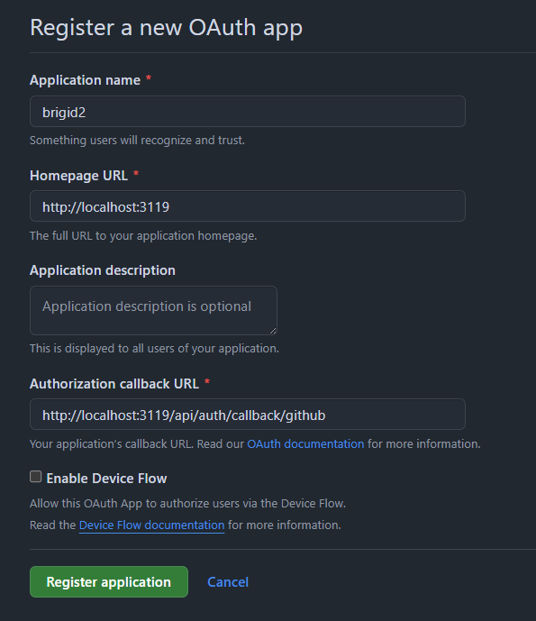
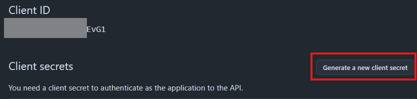
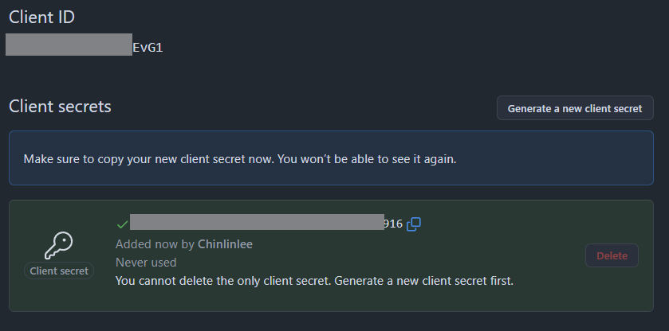

import { Steps, Step } from "fumadocs-ui/components/steps";

## GitHub OAuth 配置流程

<Steps>
    <Step>
        ## 創建 OAuth App

        - 進入 [GitHub Developer Settings](https://github.com/settings/developers)
        - 點擊「New OAuth App」
        - 填寫「Application Name」
        - 填寫「Homepage URL」，例如：`http://localhost:3119`
        - 填寫「Authorization Callback URL」，例如：`http://localhost:3119/api/auth/callback/github`
        - 點擊「Register application」
        
    </Step>

    <Step>
        ## 獲取 Client ID 和 Client Secret

        - 進入剛剛建立的 OAuth App 頁面
        - 點擊「Generate a new client secret」
        
        - 創建後，複製「`Client ID`」和「`Client Secret`」
        
    </Step>

    <Step>
        ## 設定 Brigid 的環境變數
        
        - 將獲取到的 Client ID 和 Client Secret 設定放在 Brigid 的 `.env` 檔案的 `AUTH_GITHUB_ID` 和 `AUTH_GITHUB_SECRET` 環境變數

        在啟用 Next Auth 身分驗證時，你需要配置以下環境變數：

        | 環境變數 | 類型 | 描述 |
        | :--- | :--- | :--- |
        | `NEXT_PUBLIC_ENABLE_AUTH` | boolean | 是否啟用身分驗證功能 |
        | `NEXTAUTH_SECRET` | string | NextAuth (Auth.js) 使用的金鑰 (至少 32 字元) |
        | `NEXTAUTH_URL` | string | NextAuth (Auth.js) 使用的 URL，通常為應用程式的網址 |
        | `AUTH_GITHUB_ID` | string | GitHub 的 Client ID |
        | `AUTH_GITHUB_SECRET` | string | GitHub 的 Client Secret |

        <Callout type="info">
        前往[環境變數](/zh-TW/docs/self-hosting/env-info/auth)可查閱更多環境變數的設定方式
        </Callout>
    </Step>
</Steps>
