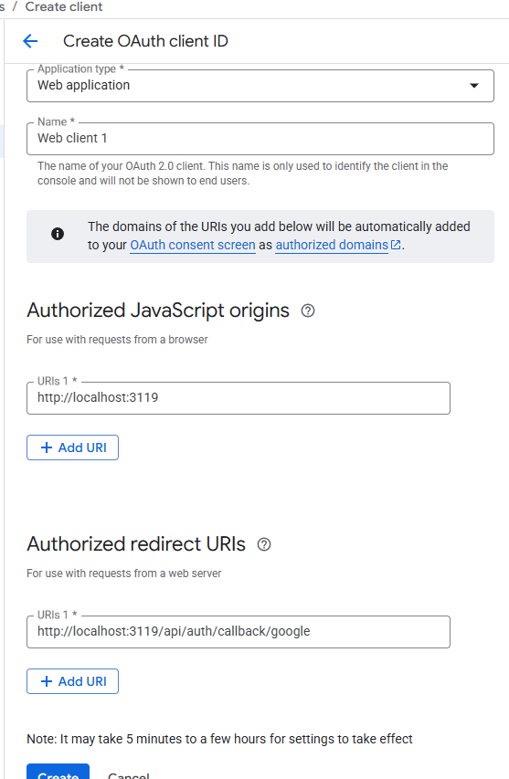

import { Steps, Step } from "fumadocs-ui/components/steps";

## Google OAuth Configuration Steps

<Steps>
    <Step>
        ## Select Project

        - Open [Google API Console](https://console.developers.google.com/)
        - Select a project (if you don't have one, please create one)
    </Step>

    <Step>
        ## Set Up Google Authentication Platform

        - Navigate to the "OAuth Consent Screen" in the left sidebar
        
        - Fill in the "Application Name", "User Support Email", "Target Audience", and "Contact Information"
        - Select "External" as the "User Type"
        - Fill in the "Contact Information"
        - Accept the "Terms of Service"
        - Click "Create"
    </Step>

    <Step>
        ## Set Up Google Authentication Credentials

        - Click "Create OAuth Client ID" in the "Overview" page
        - Select "Web Application" as the "Application Type"
        - Fill in the "Application Name"
        - Fill in the "Authorized JavaScript Origins" with the URL of your application, e.g. `http://localhost:3119`
        - Fill in the "Authorized Redirect URIs" with the callback URL, e.g. `http://localhost:3119/api/auth/callback/google`
        - Click "Create"
        
    </Step>

    <Step>
        ## Get Client ID and Client Secret
        
        - Navigate to the "OAuth Clients" in the left sidebar
        - Click the OAuth Client you just created
        - Copy the "Client ID" and "Client Secret"
        
    </Step>

    <Step>
        ## Set Up Brigid Environment Variables
        
        - Set the `AUTH_GOOGLE_ID` and `AUTH_GOOGLE_SECRET` environment variables in the `.env` file as the Client ID and Client Secret you got from the Google API Console

        When enabling Next Auth authentication, you need to configure the following environment variables:

        | Environment Variable | Type | Description |
        | :--- | :--- | :--- |
        | `NEXT_PUBLIC_ENABLE_AUTH` | boolean | Whether to enable the authentication system |
        | `NEXTAUTH_SECRET` | string | NextAuth (Auth.js) 使用的金鑰 (至少 32 字元) |
        | `NEXTAUTH_URL` | string | NextAuth (Auth.js) 使用的 URL，通常為應用程式的網址 |
        | `AUTH_GOOGLE_ID` | string | Google 的 Client ID |
        | `AUTH_GOOGLE_SECRET` | string | Google 的 Client Secret |

        <Callout type="info">
        Visit [Environment Variables](/en/docs/self-hosting/env-info/auth) for more information about environment variables
        </Callout>
    </Step>
</Steps>