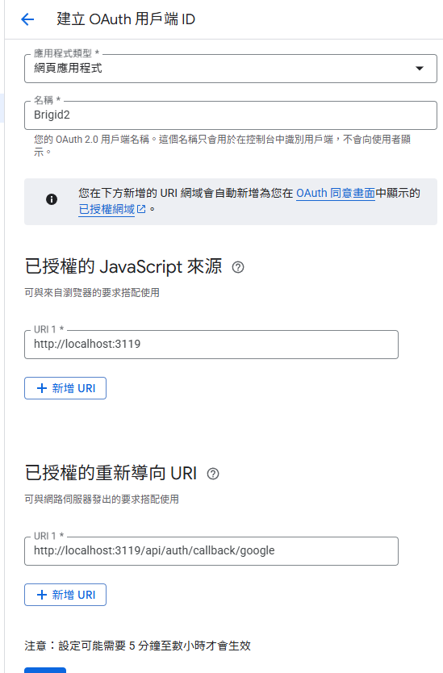
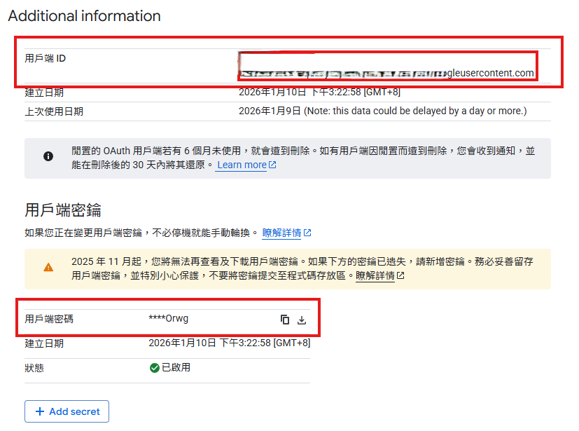

import { Steps, Step } from "fumadocs-ui/components/steps";

## Google OAuth 配置流程

<Steps>
    <Step>
        ## 選擇專案

        - 打開 [Google API Console](https://console.developers.google.com/)
        - 選取專案 (如果沒有，請先建立一個)
    </Step>

    <Step>
        ## 設定 Google 驗證平台

        - 進入左邊導航列的「OAuth 同意畫面」
        
        - 點擊「開始」
        - 填寫「應用程式名稱」、「使用者支援電子郵件」
        - 目標對象選擇「外部」
        - 填寫聯絡資訊
        - 同意使用者條款
        - 點擊「建立」
    </Step>
    
    <Step>
        ## 設定 Google 驗證憑證

        - 在「總覽」畫面，點擊「建立 OAuth 用戶端」
        - 應用程式類型選擇「網頁應用程式」
        - 填寫名稱
        - 已授權的 JavaScript 來源填寫你的應用的網域，例如：`http://localhost:3119`
        - 已授權的重新導向 URI 填寫對應 callback 網址，例如：`http://localhost:3119/api/auth/callback/google`
        - 點擊「建立」
        
    </Step>

    <Step>
        ## 取得 Client ID 和 Client Secret

        - 進入左邊導航列的「用戶端」，點擊剛剛建立的用戶端，進入詳細資訊頁面
        - 複製「用戶端 ID」和「用戶端密碼」
        
    </Step>

    <Step>
        ## 設定 Brigid 的環境變數

        - 將獲取到的 Client ID 和 Client Secret 設定放在 Brigid 的 `.env` 檔案的 `AUTH_GOOGLE_ID` 和 `AUTH_GOOGLE_SECRET` 環境變數

        在啟用 Next Auth 身分驗證時，你需要配置以下環境變數：

        | 環境變數 | 類型 | 描述 |
        | :--- | :--- | :--- |
        | `NEXT_PUBLIC_ENABLE_AUTH` | boolean | 是否啟用身分驗證功能 |
        | `NEXTAUTH_SECRET` | string | NextAuth (Auth.js) 使用的金鑰 (至少 32 字元) |
        | `NEXTAUTH_URL` | string | NextAuth (Auth.js) 使用的 URL，通常為應用程式的網址 |
        | `AUTH_GOOGLE_ID` | string | Google 的 Client ID |
        | `AUTH_GOOGLE_SECRET` | string | Google 的 Client Secret |

        <Callout type="info">
        前往[環境變數](/zh-TW/docs/self-hosting/env-info/auth)可查閱更多環境變數的設定方式
        </Callout>
    </Step>
</Steps>

